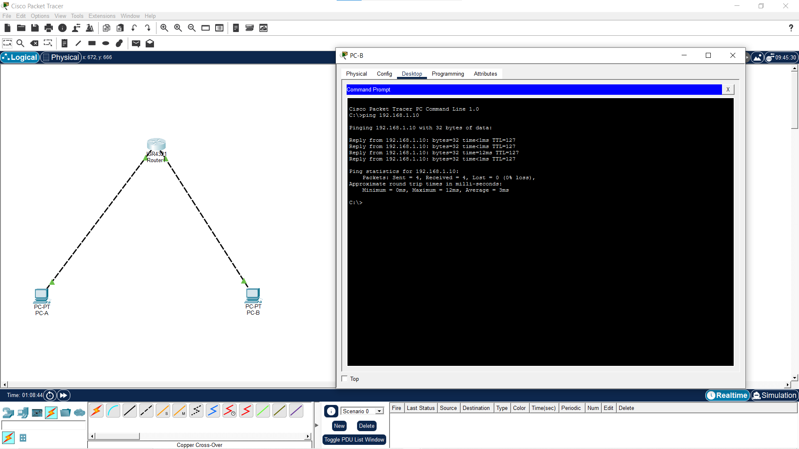

# 📸 Network Diagrams Gallery

## Day 1: Peer-to-Peer Connection
**Concept:** Crossover Cabling & Basic Ping

---

## Day 2: Small Office LAN (Switching)
**Concept:** Star Topology & MAC Address Learning

---

## Day 3: The "Two-Room" Network(routing)
**Concept:** Connecting Two Networks (The "Hello World" of Routing)

---
