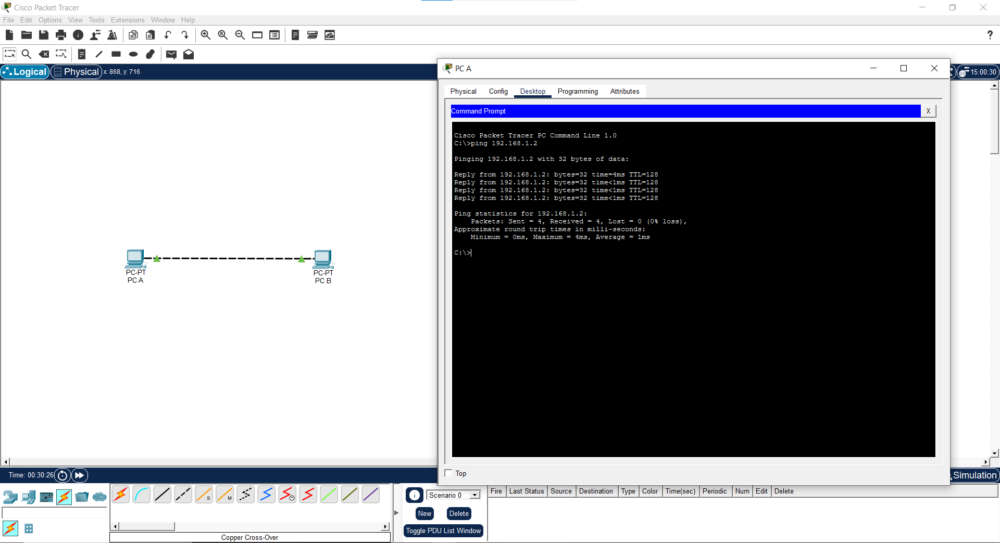

# Day 1: Peer-to-Peer Network Connectivity

**Date:** Feb 2, 2026
**Lab Type:** Foundation

### 🎯 Objective
To understand physical layer connectivity between two end devices without an intermediary device (Switch/Router).

### 🛠️ Topology

### ⚙️ Configuration
| Device | Interface | IP Address | Subnet Mask |
|:---|:---|:---|:---|
| PC-A | FastEthernet0 | 192.168.1.1 | 255.255.255.0 |
| PC-B | FastEthernet0 | 192.168.1.2 | 255.255.255.0 |

### 🧪 Verification
* **Cable Used:** Crossover Cable (because connecting like-devices).
* **Ping Test:** Successful. PC-A received 4 replies from PC-B.

### 🧠 Key Learnings
* PCs connected directly require a **Crossover Cable** to swap TX/RX signals.
* Devices on the same network must have unique IP addresses but share the same Subnet Mask.