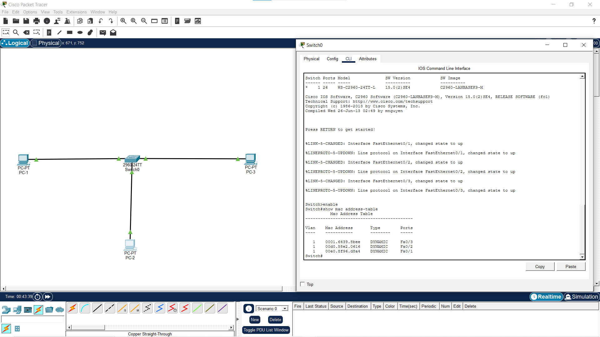

# Day 2: Basic Switching & LAN Creation

**Date:** Feb 3, 2026
**Focus:** Layer 2 Switching

### 🎯 Objective
To build a Star Topology LAN using a Cisco 2960 Switch and examine how switches learn MAC addresses.

### 🛠️ Topology

### ⚙️ The MAC Address Table
* **Command Used:** `show mac address-table`
* **Observation:** The switch initially had an empty table. After I sent pings, it populated the table by mapping the Source MAC address of the incoming frames to the specific port (e.g., Fa0/1).

### 🧠 Key Learnings
* **Straight-Through Cables** are used for PC-to-Switch connections.
* **MAC Addresses** are physical, hard-coded IDs (Layer 2).
* Switches are intelligent—they learn which device is connected to which port to avoid broadcasting traffic to everyone.